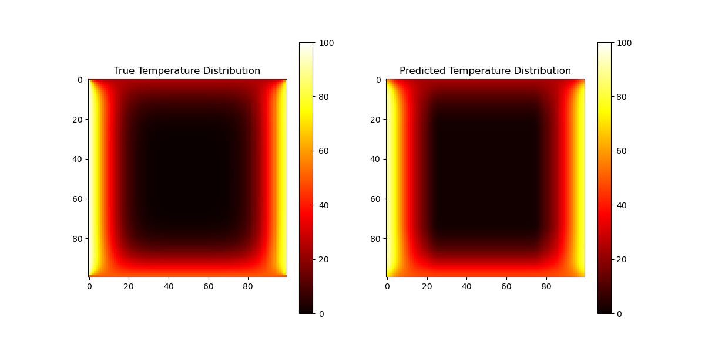
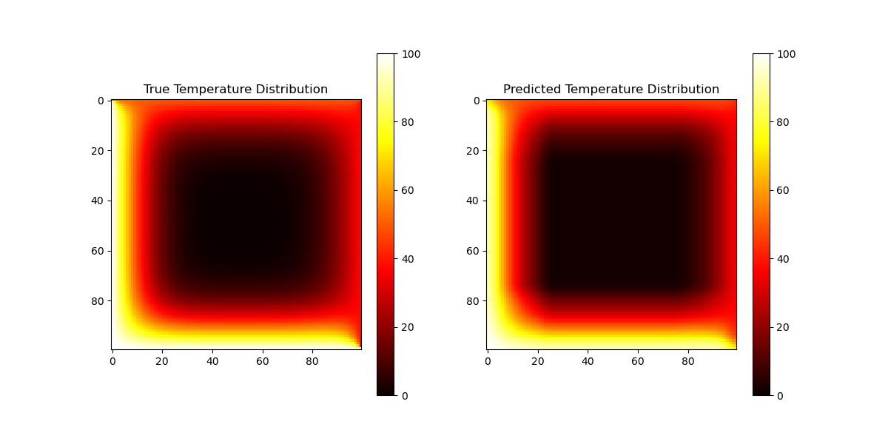

# Thermal-Field-Prediction
This project provides a U-Net based model for solving a Laplace equation-related temperature distribution problem. The model takes boundary values as input and predicts internal temperature distributions.

## Numerical methods

Run the matlab code `heat_eq.m` to genrate the training data. Training data are temperature mapping in with different boundary condition settings. 

All data would be saved in a `.csv` file, each row represents a data point in training.

## Requirements

Python Version: Python 3.8 or higher is recommended.

Packages:

- TensorFlow (2.x)
- NumPy (1.19+)
- Matplotlib
- SciPy

To install the required packages, run:
```
pip3 install tensorflow numpy matplotlib scipy
```
## Data Preparation

The code expects a CSV file named `laplace_results_v3.csv` containing the data. Each line of the CSV file (except the header) should represent a flattened 100x100 temperature field.
Ensure that `laplace_results_v3.csv` is present in the same directory as the code.

## Running the Code

Set train_mode in the code:

If `train_mode = True`, the code will train a U-Net model using the specified dataset. It will save the best model as best_model_v3.h5.

If `train_mode = False`, the code will load the previously saved `best_model_v3.h5` and evaluate it on the test set. It will also visualize a prediction sample.
Execute the Code:

```
python3 main.py
```
During training (`train_mode = True`):
The code splits the dataset into training, validation, and testing sets (`70%/20%/10%`).

It trains the model for up to 50 epochs, using early stopping to prevent overfitting.

After training, it evaluates the model on the test set and plots training/validation curves for Loss and MAE.

It saves the best performing model as `best_model_v3.h5`.

During evaluation/prediction (`train_mode = False`):

The code loads the pre-trained `best_model_v3.h5`.

It evaluates performance on the test set.
It selects one sample from the test set, makes a prediction, and visualizes both the true and predicted temperature fields.

Examples:



